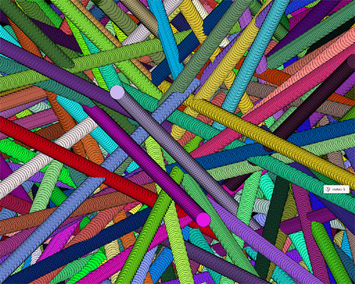



## Dots 2 \- PIPES \[Animated Screen Saver Algorythm\]

### Description

This is the sequel to my previous submission "Dots". Meet "Dots 2". This grpahical process will produce "pipe-like" effects.
 
### More Info
 

             |
---                |---
**Submitted On**   |2004-05-13 12:23:12
**By**             |[\[\]\)utch\[\]v\[\]aster](https://github.com/Planet-Source-Code/PSCIndex/blob/master/ByAuthor/utch-v-aster.md)
**Level**          |Intermediate
**User Rating**    |3.5 (14 globes from 4 users)
**Compatibility**  |VB 5\.0, VB 6\.0
**Category**       |[Graphics](https://github.com/Planet-Source-Code/PSCIndex/blob/master/ByCategory/graphics__1-46.md)
**World**          |[Visual Basic](https://github.com/Planet-Source-Code/PSCIndex/blob/master/ByWorld/visual-basic.md)
**Archive File**   |[Dots\_2\_\-\_P1744745132004\.zip](https://github.com/Planet-Source-Code/utch-v-aster-dots-2-pipes-animated-screen-saver-algorythm__1-53750/archive/master.zip)

